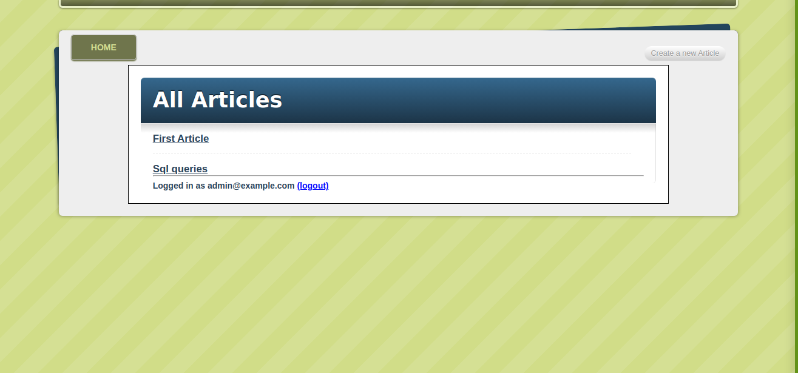

# Blogger
This is the blogger App for the Article



## About the Project

<!-- This project is based on the . -->

This is project about the creating the blog for Articles. It follows the CRUD operation and user authentication. This project follows the tutorials from [jumpstartlab](http://tutorials.jumpstartlab.com/projects/blogger.html).
The project contails following features:
- User Authentication
    - Signup
    - Login
    - Logout
- Create Articles
- Edit Articles
- Delete Articles
- Update Articles 
- Create Tags
- Display Tags
User is only allowed to crete, Edit or delete Article if they have logged in.

### Built With

- [Rails](https://guides.rubyonrails.org/)
- [Ruby](https://www.ruby-lang.org/en/)
- HTML
- CSS
- SQLite3

## Live Demo

[Live Demo Link](https://agile-earth-33097.herokuapp.com/)

## Getting Started

To get a local copy up and running follow these simple example steps.

1. If you're running the Windows Operating System, open your command prompt. On Linux, Open your terminal.

2. Copy and paste the following code into the Terminal:


   ``` git clone https://github.com/cyonii/blogger.git ```

3. Press Enter.

4. Once the repository has been cloned, navigate inside the repository

5. After you will need to update and install some of the depedency. Use following command to install the packages
 - `bundle install`
 - `yarn install`
 - `rake db:migrate`

6. once you install the packages and migrate the database you can run the server
 - `rails s` or `rails server`

7. Enjoy


## Contributing

Contributions, issues, and feature requests are welcome!
Feel free to check the [issues page](../../issues).

## Show your support

Give a ⭐️ if you like this project!


## Authors


👤 **Divyesh Patel**

- GitHub: [@Div685](https://github.com/Div685)
- Twitter: [@div_685](https://twitter.com/div_685)
- LinkedIn: [Divyesh Patel](https://www.linkedin.com/in/divyesh-patel-2a15a6107)

👤 **Silas Kalu**

- GitHub: [@cyonii](https://github.com/cyonii)
- Twitter: [@theOnuoha](https://twitter.com/theOnuoha)
- LinkedIn: [Silas Kalu](https://www.linkedin.com/in/silas-kalu-2a9a13199/)

## Acknowledgments

- [Ruby-doc](https://ruby-doc.org/core-2.6.5)
- [Rails-doc](https://guides.rubyonrails.org/)